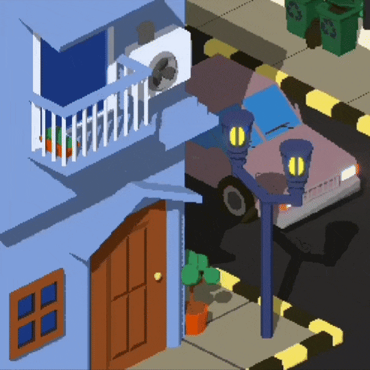

  

# Petra Michael

**Software Developer** — Jakarta, Indonesia  
Dedicated to the development of tools and systems that combine innovation, functionality, and user-focused design.  
Open to collaboration in areas spanning software engineering, automation, and applied machine learning.

  

## Professional Profile
- Current Role: Software Development Engineering Intern at IDEMIA IST  
- Academic Status: Undergraduate Student at Bina Nusantara Univeristy in Computer Science Major
- Primary Focus: Full-stack development, data-driven applications, machine learning systems, workflow optimization, 
- Additional Interests: Creative coding, user interface/experience design, browser extensions, system integrations  

  

## Research and Development Interests
Areas of particular engagement include:  

- Real-time and hybrid interfaces (web, desktop, browser extensions)  
- Applied machine learning and data science (stock market analysis, diagnostics)  
- Automation and tooling for workflow enhancement  
- Computational creativity (interactive visuals, dynamic wallpapers, generative systems)
- 3D Animation / Illustration using tools like Blender3D or pixel arts in general 

  

## Selected Projects

| Project | Description |
|---------|-------------|
| [**stock-screener**](https://github.com/aimatochysia/stock-screener) | A system for screening Indonesian stocks using various techniques both fundamental and technical, merging finance with data engineering. |
| [**Wallpaper-Engine-Code-Clock**](https://github.com/aimatochysia/Wallpaper-Engine-Code-Clock) | Customizable clock wallpaper using code language style, uniting aesthetics and practical functionality. |
| [**ficbatch**](https://github.com/aimatochysia/ficbatch) | Mobile application designed to facilitate bulk download and reading of AO3 fanfiction. A practical and community-driven initiative. |
| [**Pinoted**](https://github.com/aimatochysia/Discord-RPC) | Note-taking application that allows you to create sticky notes that stay on your screen. It is built using Java and provides the ability to organize multiple notes within a notebook. |
| [**Color Picker Extension**](https://github.com/aimatochysia/color-picker-extension) | Chrome extension enabling precise color selection, with support for dynamic backgrounds and HEX/RGB toggling. |
| [**Discord RPC**](https://github.com/aimatochysia/Discord-RPC) | Rich presence tool integrating dynamic application cycling with GIF support, balancing utility with user experience. |
| [**Pending Publication - Ai Usage in Finding of CXR Abnormalities**](https://github.com/aimatochysia/CXR-Radiology-Analysis-and-Diagnosis-System) | Deep learning model for pneumonia detection via chest X-rays, highlighting healthcare applications of machine learning. |

  

## Skills and Tools

- **Programming Languages:** Python, JavaScript, Dart (Flutter), Java, Jython, HTML/CSS, APDU Protocol, Javacard
- **Frameworks and Technologies:** ReactJS, Flask, Flutter, Jupyter, Chrome Extension APIs, NextJS
- **Development Practices:** Git, GitHub Actions, VS Code, Automation workflows, UI/UX workflows
- **Creative and Design Interests:** 3D Animation & Illustration (mostly Blender3D and pixel art), interactive systems (msotly webapp or multi-platform apps), Applied Machine Learning (YOLO and CNN)

  

## Contact Links

- Instagram: [**@azraelhael**](https://www.instagram.com/azraelhael)  
- LinkedIn: [**aimatochysia**](https://www.linkedin.com/in/aimatochysia)  
- Twitter (X): [**@michaelxpetra**](https://x.com/michaelxpetra)  

  

## Future Directions

- Diving into astrophysics, material science, and 
- Polishing frontend design and experience
- More IoT projects
- Taking care of my plants 🌱

---

> *“The end of law is not to abolish or restrain, but to preserve and enlarge freedom.”*
